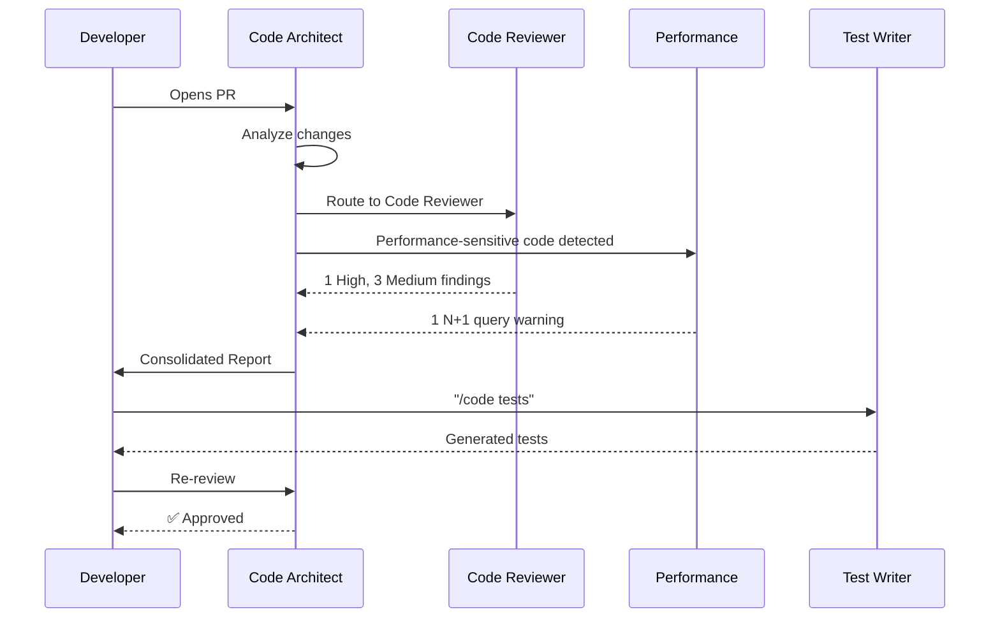
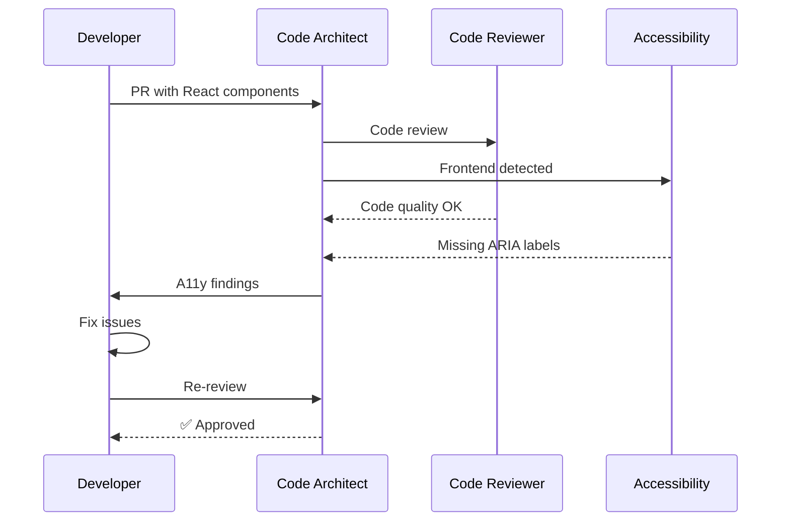

# Code Agent Family Guide

> [Doctrine](../../README.md) > [AI](./README.md) > Code Agents

The key words "MUST", "MUST NOT", "REQUIRED", "SHALL", "SHALL NOT", "SHOULD",
"SHOULD NOT", "RECOMMENDED", "MAY", and "OPTIONAL" in this document are to be
interpreted as described in [RFC 2119](https://datatracker.ietf.org/doc/html/rfc2119).

## Quick Reference

| Command | Agent | Model | Use Case |
|---------|-------|-------|----------|
| `/code` | Code Architect | Opus | Full code assessment |
| `/code quick` | Code Reviewer | Haiku | Fast scan, critical only |
| `/code review` | Code Reviewer | Sonnet | Standard code review |
| `/code perf` | Performance Reviewer | Sonnet | Performance analysis |
| `/code a11y` | Accessibility Reviewer | Sonnet | WCAG/A11y compliance |
| `/code api` | REST API Reviewer | Sonnet | REST API design |
| `/code api --graphql` | GraphQL API Reviewer | Sonnet | GraphQL schema design |
| `/code tests` | Test Writer | Sonnet | Test generation |
| `/code simplify` | Code Simplifier | Sonnet | Complexity reduction |
| `/code docs` | Documentation Writer (docs family) | Sonnet | Documentation |

## Overview

The Doctrine Code Agent Family is a coordinated set of specialized AI agents
for comprehensive code analysis and generation. Unlike monolithic review tools,
this family provides:

1. **Specialized Expertise** - Each agent is an expert in its domain
2. **Cost Optimization** - Right model for each task (Haiku → Sonnet → Opus)
3. **Comprehensive Coverage** - From quick scans to deep architectural review
4. **Educational Focus** - Explains issues, not just flags them
5. **Auto-Fix Oriented** - Every issue includes remediation

## Architecture

```text
┌─────────────────────────────────────────────────────────────────────────────┐
│                       DOCTRINE CODE AGENT FAMILY                            │
├─────────────────────────────────────────────────────────────────────────────┤
│                                                                              │
│                      ┌────────────────────────────┐                         │
│                      │     CODE ARCHITECT         │                         │
│                      │    (Opus - Coordinator)    │                         │
│                      └─────────────┬──────────────┘                         │
│                                    │                                         │
│  ┌──────────┬──────────┬──────────┼──────────┬──────────┬──────────┐       │
│  ▼          ▼          ▼          ▼          ▼          ▼          ▼       │
│ ┌────────┐ ┌────────┐ ┌────────┐ ┌────────┐ ┌────────┐ ┌────────┐ ┌──────┐│
│ │ CODE   │ │PERFORM-│ │ACCESS- │ │  API   │ │  API   │ │ TEST   │ │SIMPL-││
│ │REVIEWER│ │ ANCE   │ │IBILITY │ │  REST  │ │GRAPHQL │ │ WRITER │ │IFIER ││
│ │(Sonnet)│ │(Sonnet)│ │(Sonnet)│ │(Sonnet)│ │(Sonnet)│ │(Sonnet)│ │(Son.)││
│ └────────┘ └────────┘ └────────┘ └────────┘ └────────┘ └────────┘ └──────┘│
│                                                                              │
│ ┌────────────────────────────────────────────────────────────────────────┐  │
│ │                        SUPPORTING AGENTS                               │  │
│ │  ┌──────────────┐  ┌──────────────┐  ┌──────────────┐                 │  │
│ │  │  DOC WRITER  │  │   VERIFY     │  │   (Future)   │                 │  │
│ │  │   (Sonnet)   │  │    BUILD     │  │              │                 │  │
│ │  │ docs family  │  │  (Sonnet)    │  │              │                 │  │
│ │  └──────────────┘  └──────────────┘  └──────────────┘                 │  │
│ └────────────────────────────────────────────────────────────────────────┘  │
└─────────────────────────────────────────────────────────────────────────────┘
```

## Agent Specifications

### Tier 1: Strategic Coordinator

#### Code Architect

The **Code Architect** is the strategic coordinator for all code review efforts.

| Attribute | Value |
|-----------|-------|
| **Model** | Opus 4.5 |
| **Command** | `/code` |
| **File** | `configs/claude/agents/code/architect.md` |

**Responsibilities**:

- Assess overall code quality and architecture
- Route to appropriate specialist agents
- Synthesize findings across domains
- Provide prioritized remediation roadmap

**When to Use**:

- Comprehensive code review
- Cross-cutting concerns (security + performance + quality)
- Major feature reviews
- Pre-merge gates for critical code

---

### Tier 2: Domain Specialists

#### Code Reviewer

General-purpose code review with modes.

| Attribute | Value |
|-----------|-------|
| **Model** | Sonnet 4.5 (quick: Haiku) |
| **Command** | `/code review`, `/code quick` |
| **File** | `configs/claude/agents/code/reviewer.md` |

**Modes**:

- **Quick** (Haiku): Critical issues only, <50 LOC
- **Standard** (Sonnet): Security, performance, quality
- **Deep** (Sonnet→Opus): Architecture, patterns, edge cases

**Coverage**:

- Security (OWASP Top 10 basics)
- Performance (N+1, memory, algorithms)
- Quality (complexity, duplication, naming)
- Tests (coverage, edge cases)

---

#### Performance Reviewer

Deep performance analysis.

| Attribute | Value |
|-----------|-------|
| **Model** | Sonnet 4.5 |
| **Command** | `/code perf` |
| **File** | `configs/claude/agents/code/performance.md` |

**Coverage**:

- Database queries (N+1, missing indexes)
- Memory patterns (leaks, allocation)
- Algorithmic complexity
- Caching strategies
- Connection pooling
- Async/queue patterns
- Observability instrumentation

---

#### Accessibility Reviewer

WCAG/A11y compliance specialist.

| Attribute | Value |
|-----------|-------|
| **Model** | Sonnet 4.5 |
| **Command** | `/code a11y` |
| **File** | `configs/claude/agents/code/accessibility.md` |

**Coverage**:

- WCAG 2.1 AA compliance
- ARIA patterns
- Keyboard navigation
- Screen reader compatibility
- Color contrast
- Focus management

**Unique Value**: Only AI tool with deep A11y analysis.

---

#### REST API Reviewer

REST API design specialist.

| Attribute | Value |
|-----------|-------|
| **Model** | Sonnet 4.5 |
| **Command** | `/code api` |
| **File** | `configs/claude/agents/code/api-rest.md` |

**Coverage**:

- RESTful conventions
- HTTP methods and status codes
- Pagination patterns
- Error response format
- Versioning strategy
- Rate limiting

---

#### GraphQL API Reviewer

GraphQL schema design specialist.

| Attribute | Value |
|-----------|-------|
| **Model** | Sonnet 4.5 |
| **Command** | `/code api --graphql` |
| **File** | `configs/claude/agents/code/api-graphql.md` |

**Coverage**:

- Schema design
- Query complexity
- N+1 prevention (DataLoader)
- Authorization patterns
- Naming conventions
- Deprecation strategy

---

#### Test Writer

Comprehensive test generation.

| Attribute | Value |
|-----------|-------|
| **Model** | Sonnet 4.5 |
| **Command** | `/code tests` |
| **File** | `configs/claude/agents/code/test-writer.md` |

**Coverage**:

- Mutation-first approach
- Property-based testing
- Visual regression testing
- Contract testing (Pact)
- E2E patterns
- Test data generation

---

#### Code Simplifier

Complexity reduction specialist.

| Attribute | Value |
|-----------|-------|
| **Model** | Sonnet 4.5 |
| **Command** | `/code simplify` |
| **File** | `configs/claude/agents/code/simplifier.md` |

**Coverage**:

- Cyclomatic complexity reduction
- Extract method opportunities
- Dead code removal
- Abstraction simplification
- Before/after metrics

---

### Tier 3: Supporting Agents

#### Documentation Writer

Documentation generation. `/code docs` **MUST** route to the documentation
family's `documentation-writer` subagent: the code family defines no
documentation agent of its own.

| Attribute | Value |
|-----------|-------|
| **Agent name** | `documentation-writer` |
| **Model** | Sonnet (frontmatter `model: sonnet`) |
| **Command** | `/code docs` |
| **File** | `configs/claude/agents/docs/writer.md` |

**Output**:

- API documentation
- README sections
- Code comments
- Architecture diagrams (Mermaid)

**Why**: documentation already has a dedicated agent family, so the code family
delegates instead of carrying a second definition that would drift from it. The
code family therefore holds exactly eight agents, and `/code docs` is a
cross-family route: an installation that omits `agents/docs/writer.md` leaves
the subcommand with no agent to invoke, so installers **MUST** copy that file
alongside the eight code agents.

---

## Language-Specific Review Checklists

Code agents **MUST** apply language-specific checks based on the file type being reviewed.

### Python Review Checklist

| Category | Check | Severity |
|----------|-------|----------|
| **Type Safety** | Type hints on public APIs | SHOULD |
| **Type Safety** | `typing.Optional` for nullable params | SHOULD |
| **Type Safety** | `from __future__ import annotations` (3.7+) | MAY |
| **Async** | `async def` without `await` calls | High |
| **Async** | Blocking calls in async functions | High |
| **Async** | `asyncio.run()` inside running event loop | Critical |
| **Resource Mgmt** | Context managers for file/DB handles | MUST |
| **Resource Mgmt** | Unclosed resources in exception paths | High |
| **Performance** | Mutable default arguments | High |
| **Performance** | String concatenation in loops | Medium |
| **Performance** | `list()` where generator sufficient | Low |
| **Security** | `pickle` with untrusted data | Critical |
| **Security** | `eval()` or `exec()` with user input | Critical |
| **Security** | SQL string formatting (not parameterized) | Critical |
| **Testing** | Missing `pytest.mark.asyncio` for async tests | Medium |
| **Testing** | `mock.patch` without `autospec=True` | Low |

### Go Review Checklist

| Category | Check | Severity |
|----------|-------|----------|
| **Errors** | Ignoring error returns (`_ = fn()`) | High |
| **Errors** | Naked `panic()` in library code | Critical |
| **Errors** | `log.Fatal()` in library code | High |
| **Concurrency** | Data races (shared state without sync) | Critical |
| **Concurrency** | Goroutine leaks (unbounded spawning) | High |
| **Concurrency** | Sending on closed channel | Critical |
| **Concurrency** | Missing `defer mu.Unlock()` pattern | High |
| **Resource Mgmt** | Missing `defer resp.Body.Close()` | High |
| **Resource Mgmt** | Missing `defer rows.Close()` | High |
| **Performance** | Passing large structs by value | Medium |
| **Performance** | String concatenation in loops | Medium |
| **Performance** | `append()` without pre-allocation hint | Low |
| **Security** | Unvalidated user input in `sql.Query` | Critical |
| **Security** | `unsafe` package without justification | High |
| **Testing** | `t.Parallel()` missing for independent tests | Low |
| **Testing** | Table-driven tests without subtests | Low |

### Rust Review Checklist

| Category | Check | Severity |
|----------|-------|----------|
| **Safety** | `unsafe` without safety comment | MUST FIX |
| **Safety** | `unwrap()` in library code | High |
| **Safety** | `expect()` without context message | Medium |
| **Safety** | Raw pointer dereference patterns | Critical |
| **Async** | Holding `Mutex` across `.await` | Critical |
| **Async** | Blocking in async context | High |
| **Async** | `tokio::spawn` without error handling | Medium |
| **Lifetimes** | Unnecessary `'static` bounds | Medium |
| **Lifetimes** | Missing lifetime elision opportunities | Low |
| **Performance** | `clone()` where borrow sufficient | Medium |
| **Performance** | `collect()` before `filter()` | Medium |
| **Performance** | `Box<dyn Trait>` where generic sufficient | Low |
| **Error Handling** | `anyhow` in library (vs `thiserror`) | Medium |
| **Error Handling** | Unused `Result` (missing `?` or handling) | High |
| **Testing** | Missing `#[should_panic]` for panic tests | Low |
| **Testing** | No `proptest` for invariant-heavy code | MAY |

### TypeScript Review Checklist

| Category | Check | Severity |
|----------|-------|----------|
| **Type Safety** | `any` type usage | High |
| **Type Safety** | Non-null assertions (`!`) without justification | Medium |
| **Type Safety** | Missing return types on public APIs | SHOULD |
| **Type Safety** | `as` casts without type guards | Medium |
| **Async** | Missing `await` on Promise | Critical |
| **Async** | Floating Promises (not awaited or `.catch`) | High |
| **Async** | `async` function without `await` | Medium |
| **React** | Missing dependency in `useEffect` deps array | High |
| **React** | State mutation instead of `setState` | Critical |
| **React** | Missing `key` prop in lists | High |
| **React** | `useCallback`/`useMemo` without dependencies | High |
| **Performance** | Inline function in JSX props | Low |
| **Performance** | Re-renders from new object/array literals | Medium |
| **Security** | `dangerouslySetInnerHTML` without sanitization | Critical |
| **Security** | `eval()` or `Function()` usage | Critical |
| **Testing** | Missing `act()` wrapper for state updates | Medium |
| **Testing** | `waitFor` without assertion inside | Medium |

---

## Severity Levels

All findings use RFC 2119 severity levels:

| Level | Keyword | Meaning | Action Required |
|-------|---------|---------|-----------------|
| **Critical** | **MUST FIX** | Security vulnerability, data loss risk | Block merge |
| **High** | **MUST** | Significant bug or issue | Fix before merge |
| **Medium** | **SHOULD** | Improvement needed | Fix soon |
| **Low** | **MAY** | Minor enhancement | Consider |
| **Info** | N/A | Observation only | Awareness |

## Output Format

All code agents **MUST** use this output format:

````markdown
## Code Review: [Brief Title]

| Metric | Value |
|--------|-------|
| **Review Effort** | [1-5] |
| **Risk Level** | Low / Medium / High / Critical |
| **Change Size** | XS / S / M / L / XL |

### 🔴 Critical (must fix before merge)

- [ ] **[Category]**: [description] (`file:line`) — **[confidence]%**

  **Evidence**: [how we know this is an issue]

  **Before**:
  ```[lang]
  [problematic code]
  ```

  **After**:

  ```[lang]
  [fixed code]
  ```

  **Why**: [explanation]

### 🟡 Warning (should fix)

### 🔵 Suggestion (consider)

### ✅ Positive Observations

### Summary

[1-2 sentence overall assessment]

````

## Cost Optimization

| Agent | Model | Est. Cost/Invocation | Volume |
|-------|-------|---------------------|--------|
| Code Architect | Opus | $0.50 | Per PR (major) |
| Code Reviewer | Sonnet | $0.20 | Per PR |
| Code Reviewer Quick | Haiku | $0.02 | Per commit |
| Performance Reviewer | Sonnet | $0.25 | On request |
| Accessibility Reviewer | Sonnet | $0.20 | Frontend PRs |
| API Reviewers | Sonnet | $0.20 | API changes |
| Test Writer | Sonnet | $0.30 | On request |
| Code Simplifier | Sonnet | $0.25 | Post-feature |
| Documentation Writer | Sonnet | $0.20 | On request |

Estimates assume Claude API list prices — Opus 4.5 at $5/$25, Sonnet 4.5 at
$3/$15 and Haiku 4.5 at $1/$5 per million input/output tokens — over a
PR-sized context: roughly 10K in and 2K out for quick mode, 20K in and 8K out
for one specialist, 40K in and 12K out for the Opus coordinator. Teams **MUST**
re-derive them from their own provider's price list.

**Cost by Mode**:

| Mode | Typical Cost | Use Case |
|------|--------------|----------|
| `/code quick` | ~$0.02 | Every commit |
| `/code review` | ~$0.20 | PR review |
| `/code` | ~$0.80 | Full assessment |

### Model Lifecycle

Every route **MUST** name an exact API model ID in the frontmatter of the
subagent or skill that runs it, and that ID **MUST** be active on the provider
the team bills through.

- The Haiku route used by `/code quick` **MUST** pin
  `claude-haiku-4-5-20251001`. It is active on the Claude API, with a
  tentative retirement not sooner than 15 October 2026.
- `claude-3-5-haiku-20241022` (Haiku 3.5) **MUST NOT** be used. It was
  deprecated on 19 December 2025 and retired on the Claude API on 19 February
  2026; requests to retired models fail.
- Those dates cover Anthropic-operated platforms only — the Claude API, Claude
  Platform on AWS and Microsoft Foundry. Amazon Bedrock and Google Cloud set
  their own retirement schedules and still serve Haiku 3.5, so teams on a
  partner platform **MUST** take the lifecycle date from that platform's own
  model table.
- Changing a model changes what the agent reports and what it costs. Teams
  **MUST** re-run the role's evaluation and re-derive the estimates above
  before adopting a replacement.

**Why**: a retired ID is not a quality trade-off, it is an outage. The
[model deprecations table](https://platform.claude.com/docs/en/about-claude/model-deprecations)
gives current status and replacement IDs, and
[pricing](https://platform.claude.com/docs/en/about-claude/pricing) marks
Haiku 3.5 as retired except on Bedrock and Google Cloud.

## Workflow Examples

### Example 1: Standard PR Review



### Example 2: Frontend Review with A11y



## Configuration

### Install the Code Agent Family

Claude Code discovers subagents and slash commands by **file location**, not by
a settings key. Installing the family means copying the definitions into a
directory Claude Code scans; there is nothing to switch on afterwards.

A project install **SHOULD** be preferred, because the definitions are then
version-controlled with the code they review:

```bash
# Run from the root of the project that will be reviewed.
# DOCTRINE points at a clone or unpacked release of this repository.
DOCTRINE="${DOCTRINE:-$HOME/src/doctrine}"

mkdir -p .claude/agents/code .claude/agents/docs .claude/commands
cp "$DOCTRINE"/agents/code/*.md .claude/agents/code/
cp "$DOCTRINE"/agents/docs/writer.md .claude/agents/docs/
cp "$DOCTRINE"/commands/code.md .claude/commands/code.md
```

The result:

```text
project/
├── .claude/
│   ├── agents/
│   │   ├── code/
│   │   │   ├── accessibility.md   # accessibility-reviewer
│   │   │   ├── api-graphql.md     # graphql-api-reviewer
│   │   │   ├── api-rest.md        # rest-api-reviewer
│   │   │   ├── architect.md       # code-architect
│   │   │   ├── performance.md     # performance-reviewer
│   │   │   ├── reviewer.md        # code-reviewer
│   │   │   ├── simplifier.md      # code-simplifier
│   │   │   └── test-writer.md     # test-writer
│   │   └── docs/
│   │       └── writer.md          # documentation-writer, for /code docs
│   └── commands/
│       └── code.md                # /code
└── AGENTS.md
```

Copy the eight code agents **and** `agents/docs/writer.md`: `/code docs`
delegates to the documentation family, so an install that skips that file
advertises a subcommand with no agent behind it.

**Why the subdirectories are safe**: Claude Code scans `.claude/agents/`
recursively and takes a subagent's identity from its `name` frontmatter field,
not from its path, so `code/` and `docs/` are organisation only and do not
change how an agent is invoked.[^subagents]

### Installation Scopes

| Scope | Location | Use when |
|-------|----------|----------|
| Project | `.claude/agents/`, `.claude/commands/` | The team shares the family |
| Personal | `~/.claude/agents/`, `~/.claude/commands/` | Every project on one machine |
| Session | `claude --agents '<json>'` | One-off trials and CI scripts |
| Plugin | The plugin's `agents/` and `skills/` directories | Fleet-wide distribution |

Project definitions win over personal ones of the same name, and managed
settings or `--agents` outrank both. Skills resolve the other way: a personal
skill overrides a project skill of the same name. Plugin agents are namespaced
as `plugin-name:agent-name`, so an explicit invocation **MUST** use the scoped
identifier.[^subagents] [^skills]

A session-scoped install saves nothing to disk and is **RECOMMENDED** for
trying a definition before committing it:

```bash
claude --agents '{
  "code-reviewer": {
    "description": "Doctrine standard code review. Use after code changes.",
    "prompt": "You are the Doctrine code-reviewer agent. Report findings by severity.",
    "tools": ["Read", "Grep", "Glob", "Bash"],
    "model": "sonnet"
  }
}'
```

For new work, a skill **SHOULD** be preferred over a command file: custom
commands have been merged into skills, `.claude/skills/code/SKILL.md` and
`.claude/commands/code.md` both provide `/code`, and the skill wins when both
exist. A skill directory also carries supporting files and controls whether
Claude may invoke it without being asked.[^skills]

### Verify, Update and Remove

Restart Claude Code after creating `.claude/agents/` for the first time: a
running session does not pick up an agents directory that did not exist when it
started. Then confirm the install:

```bash
ls .claude/agents/code .claude/agents/docs .claude/commands
grep -h '^name:' .claude/agents/code/*.md .claude/agents/docs/writer.md
```

Nine `name:` lines **MUST** appear — the eight code agents and
`documentation-writer`. Duplicate names in one directory are resolved by
filesystem read order rather than a documented precedence, so keep them unique;
`/doctor` reports duplicates.[^subagents]

Update by re-running the copy against a newer pinned release, and remove by
deleting the same paths:

```bash
# Update: pin an explicit release tag, then re-copy over the installed files.
git -C "$DOCTRINE" fetch --tags
git -C "$DOCTRINE" tag --list          # pick the release to pin
git -C "$DOCTRINE" checkout v2.9.0
cp "$DOCTRINE"/agents/code/*.md .claude/agents/code/
cp "$DOCTRINE"/agents/docs/writer.md .claude/agents/docs/
cp "$DOCTRINE"/commands/code.md .claude/commands/code.md

# Remove.
rm -rf .claude/agents/code .claude/agents/docs/writer.md .claude/commands/code.md
```

### What `settings.json` Does Not Do

`.claude/settings.json` **MUST NOT** be used to enable or install this family.
The settings schema has no `agents` key: the top-level `agent` key it does
define selects one agent for the main thread and does not register anything.
Settings change runtime behaviour — permissions, hooks, sandboxing, plugin
enablement — for definitions that are already installed:

```json
{
  "permissions": {
    "deny": ["Agent(Explore)"]
  }
}
```

**Why**: the schema accepts additional properties, so an invented block such as
`"agents": {"code": {"enabled": true}}` validates, is silently ignored, and
leaves a team believing review is switched on when no agent or command has been
installed at all. Deny the `Agent` tool outright to stop delegation entirely,
or name a subagent to block just that one.[^subagents]

## Best Practices

### DO

- **MUST** run `/code review` on all PRs
- **MUST** run `/code a11y` on frontend changes
- **MUST** address Critical and High findings before merge
- **SHOULD** use `/code quick` for rapid iteration
- **SHOULD** run `/code tests` for new features
- **MAY** use `/code simplify` after feature completion

### DON'T

- **MUST NOT** ignore Critical findings
- **MUST NOT** skip review for "small" changes
- **SHOULD NOT** rely solely on quick mode for final review
- **SHOULD NOT** skip A11y review for user-facing changes

## See Also

- [Security Agent Family](./security-agents.md) — Security-focused agents
- [System Agent Family](./system-agents.md) — Infrastructure review agents
- [Claude Code CLI](./claude-code.md) — CLI configuration

## References

[^subagents]: [Create custom subagents](https://code.claude.com/docs/en/sub-agents)
    — discovery locations, scopes, frontmatter fields and permission rules.
[^skills]: [Extend Claude with skills](https://code.claude.com/docs/en/skills)
    — skill locations and the merge of custom commands into skills.

---

*Last Updated: 2025-01-02*
*Version: 1.0.0*
