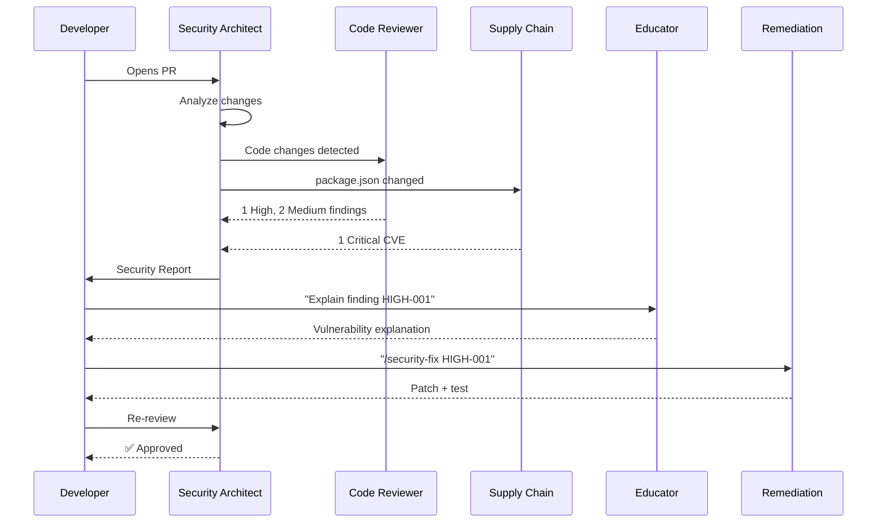
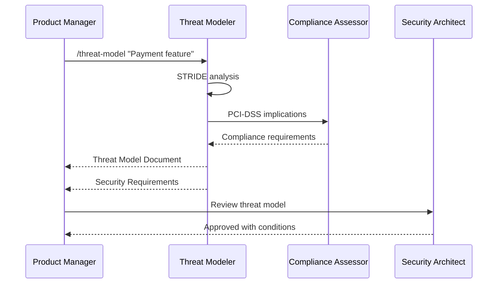
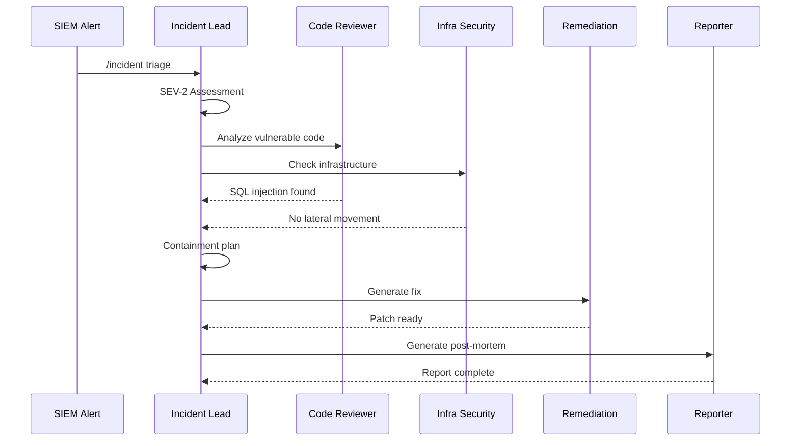

# Security Agent Family Guide

> [Doctrine](../../README.md) > [AI](./README.md) > Security Agents

The key words "MUST", "MUST NOT", "REQUIRED", "SHALL", "SHALL NOT", "SHOULD",
"SHOULD NOT", "RECOMMENDED", "MAY", and "OPTIONAL" in this document are to be
interpreted as described in [RFC 2119](https://datatracker.ietf.org/doc/html/rfc2119).

## Quick Reference

| Command | Agent | Model | Use Case |
|---------|-------|-------|----------|
| `/security` | Security Architect | Opus | Full security assessment |
| `/security quick` | Code Security Reviewer | Haiku | Fast code scan |
| `/security code` | Code Security Reviewer | Sonnet | Deep code analysis |
| `/security deps` | Supply Chain Auditor | Haiku+ | Dependency + SLSA audit |
| `/security infra` | Infrastructure Security | Sonnet | IaC, cloud, containers |
| `/security threat` | Threat Modeler | Sonnet | Design-time analysis |
| `/security network` | Network Security Analyst | Sonnet | Zero trust, segmentation |
| `/security detect` | Detection Engineering | Sonnet | Fingerprinting, hunting |
| `/security emerging` | Emerging Tech Security | Sonnet | AI/ML, quantum, TEEs |
| `/security redteam` | Red Team Operator | Opus | Attack path analysis |
| `/security siem` | SIEM/SOAR Integration | Sonnet | Detection rules, playbooks |
| `/security compliance` | Compliance Assessor | Sonnet | Regulatory compliance |
| `/incident` | Incident Response Lead | Opus | Security events |
| `/security posture` | Security Posture Score | Sonnet | Quantified security metrics |
| `/security-fix` | Remediation Generator | Sonnet | Generate fixes |

## Overview

The Doctrine Security Agent Family is a coordinated set of specialized AI
agents for comprehensive security analysis. Unlike monolithic security tools,
this family provides:

1. **Lifecycle Coverage** - From design to incident response
2. **Cost Optimization** - Right model for each task (80% cost savings vs. all-Opus)
3. **Deep Specialization** - Each agent is an expert in its domain
4. **Educational Focus** - Teaches developers, not just flags issues
5. **Standards-Based** - RFC 2119 severities, OWASP/CWE mappings

## Architecture

```text
┌─────────────────────────────────────────────────────────────────────────────┐
│                     DOCTRINE SECURITY AGENT FAMILY                          │
├─────────────────────────────────────────────────────────────────────────────┤
│                                                                              │
│                      ┌────────────────────────────┐                         │
│                      │    SECURITY ARCHITECT      │                         │
│                      │    (Opus - Coordinator)    │                         │
│                      └─────────────┬──────────────┘                         │
│                                    │                                         │
│  ┌──────────┬──────────┬──────────┼──────────┬──────────┬──────────┐       │
│  ▼          ▼          ▼          ▼          ▼          ▼          ▼       │
│ ┌────────┐ ┌────────┐ ┌────────┐ ┌────────┐ ┌────────┐ ┌────────┐ ┌──────┐│
│ │ CODE   │ │SUPPLY  │ │ INFRA  │ │THREAT  │ │NETWORK │ │COMPLI- │ │INCID-││
│ │REVIEWER│ │ CHAIN  │ │SECURITY│ │MODELER │ │SECURITY│ │ ANCE   │ │ ENT  ││
│ │(Sonnet)│ │(Haiku+)│ │(Sonnet)│ │(Sonnet)│ │(Sonnet)│ │(Sonnet)│ │(Opus)││
│ └────────┘ └────────┘ └────────┘ └────────┘ └────────┘ └────────┘ └──────┘│
│                                                                              │
│ ┌────────────────────────────────────────────────────────────────────────┐  │
│ │                     SPECIALIZED DOMAIN AGENTS                          │  │
│ │  ┌──────────────┐  ┌──────────────┐  ┌──────────────┐  ┌────────────┐ │  │
│ │  │  DETECTION   │  │  EMERGING    │  │  RED TEAM    │  │ SIEM/SOAR  │ │  │
│ │  │ ENGINEERING  │  │    TECH      │  │  OPERATOR    │  │INTEGRATION │ │  │
│ │  │  (Sonnet)    │  │  (Sonnet)    │  │   (Opus)     │  │  (Sonnet)  │ │  │
│ │  │ JA4+, Hunt   │  │ AI/ML, PQC   │  │ ATT&CK Sim   │  │ Rules, SOC │ │  │
│ │  └──────────────┘  └──────────────┘  └──────────────┘  └────────────┘ │  │
│ └────────────────────────────────────────────────────────────────────────┘  │
│                                                                              │
│ ┌────────────────────────────────────────────────────────────────────────┐  │
│ │                        SUPPORTING AGENTS                               │  │
│ │  ┌──────────────┐  ┌──────────────┐  ┌──────────────┐  ┌────────────┐│  │
│ │  │  SECURITY    │  │ REMEDIATION  │  │  SECURITY    │  │  POSTURE   ││  │
│ │  │  EDUCATOR    │  │  GENERATOR   │  │  REPORTER    │  │   SCORE    ││  │
│ │  │  (Haiku)     │  │  (Sonnet)    │  │  (Haiku)     │  │  (Sonnet)  ││  │
│ │  └──────────────┘  └──────────────┘  └──────────────┘  └────────────┘│  │
│ └────────────────────────────────────────────────────────────────────────┘  │
└─────────────────────────────────────────────────────────────────────────────┘
```

## Agent Specifications

### Tier 1: Strategic Coordinator

#### Security Architect

The **Security Architect** is the strategic coordinator for all security efforts.

| Attribute | Value |
|-----------|-------|
| **Model** | Opus 4.5 |
| **Command** | `/security` |
| **Invocation** | On PR, manual, or triggered by security-sensitive paths |

**Responsibilities**:

- Assess overall security posture
- Route to appropriate specialists
- Synthesize findings across domains
- Provide prioritized remediation roadmap

**When to Use**:

- Comprehensive security review
- Cross-domain security assessment
- Executive-level security reporting

### Tier 2: Domain Specialists

#### Threat Modeler

Analyzes system designs BEFORE implementation.

| Attribute | Value |
|-----------|-------|
| **Model** | Sonnet 4.5 |
| **Command** | `/threat-model` |
| **Methodology** | STRIDE, Attack Trees, Data Flow Diagrams |

**Output**:

- Data flow diagrams (Mermaid)
- STRIDE analysis per trust boundary
- Attack trees for critical assets
- Security requirements (RFC 2119)
- Risk assessment matrix

**When to Use**:

- New feature design
- Architecture changes
- API design review
- External integrations

---

#### Code Security Reviewer

Deep semantic analysis of source code.

| Attribute | Value |
|-----------|-------|
| **Model** | Sonnet 4.5 → Opus 4.5 (for critical findings) |
| **Command** | `/security code` or automatic on PR |
| **Coverage** | OWASP Top 10, CWE Top 25, language-specific |

**Detection Capabilities**:

- SQL/NoSQL/Command injection
- XSS (Stored, Reflected, DOM)
- CSRF, SSRF
- Authentication/Authorization flaws
- Cryptographic weaknesses
- Hardcoded secrets
- Business logic flaws

**When to Use**:

- Every PR (automated)
- Pre-merge security gate
- Legacy code audit

---

#### Supply Chain Auditor

Analyzes dependencies for risks.

| Attribute | Value |
|-----------|-------|
| **Model** | Haiku 3.5 + Sonnet 4.5 |
| **Command** | `/security deps` |
| **Coverage** | CVEs, licenses, typosquatting, maintainer risk |

**Analysis Includes**:

- Known CVE scanning
- Transitive dependency analysis
- License compliance matrix
- Supply chain attack indicators
- SBOM generation (CycloneDX/SPDX)

**When to Use**:

- Dependency updates
- New package additions
- Periodic audits (weekly/monthly)

---

#### Infrastructure Security Analyst

IaC and cloud configuration analysis.

| Attribute | Value |
|-----------|-------|
| **Model** | Sonnet 4.5 |
| **Command** | `/security infra` |
| **Coverage** | Terraform, Kubernetes, Docker, AWS/GCP/Azure |

**Checks**:

- CIS Benchmark compliance
- IAM/RBAC misconfigurations
- Network exposure
- Encryption at rest/transit
- Container security
- CI/CD pipeline security

**When to Use**:

- IaC changes
- Cloud resource provisioning
- Kubernetes deployments

---

#### Compliance Assessor

Regulatory and standards compliance.

| Attribute | Value |
|-----------|-------|
| **Model** | Sonnet 4.5 |
| **Command** | `/compliance <framework>` |
| **Frameworks** | GDPR, HIPAA, PCI-DSS, SOC 2, ISO 27001, NIST |

**Output**:

- Compliance matrix per framework
- Gap analysis with remediation
- Evidence inventory
- Audit preparation checklist

**When to Use**:

- Audit preparation
- Compliance verification
- New regulatory requirements

---

#### Incident Response Lead

Security incident handling.

| Attribute | Value |
|-----------|-------|
| **Model** | Opus 4.5 (always) |
| **Command** | `/incident` |
| **Phases** | Triage, Investigation, Containment, Remediation, Post-mortem |

**Capabilities**:

- Severity assessment (SEV-1 to SEV-4)
- Timeline reconstruction
- Root cause analysis (5 Whys)
- Containment action generation
- Post-mortem documentation

**When to Use**:

- Security alerts
- Suspected compromise
- Breach investigation

### Tier 2b: Specialized Domain Agents

#### Detection Engineering

Fingerprinting, behavioral detection, and threat hunting.

| Attribute | Value |
|-----------|-------|
| **Model** | Sonnet 4.5 |
| **Command** | `/security detect` |
| **Coverage** | JA4+, JA3, behavioral patterns, ATT&CK |

**Capabilities**:

- JA4+ fingerprinting (TLS, HTTP, SSH, TCP)
- Behavioral detection pattern development
- Threat hunting hypothesis and playbooks
- IOC lifecycle management
- Detection-as-code practices
- ATT&CK coverage analysis

**When to Use**:

- Building detection capabilities
- Threat hunting initiatives
- Fingerprinting adversary infrastructure
- Detection coverage assessment

---

#### Emerging Technologies Security

Security for AI/ML, quantum-safe crypto, and confidential computing.

| Attribute | Value |
|-----------|-------|
| **Model** | Sonnet 4.5 → Opus (novel attacks) |
| **Command** | `/security emerging` |
| **Coverage** | OWASP ML Top 10, LLM Top 10, MITRE ATLAS |

**Capabilities**:

- AI/ML security (prompt injection, model theft, data poisoning)
- Quantum-safe cryptography (ML-KEM, ML-DSA, crypto agility)
- Confidential computing (TEEs, attestation, enclaves)
- Privacy-enhancing technologies (DP, FHE, MPC)

**When to Use**:

- LLM/AI feature implementation
- Post-quantum crypto planning
- Confidential workload design
- Privacy-sensitive data processing

---

#### Network Security Analyst

Zero trust architecture and network security.

| Attribute | Value |
|-----------|-------|
| **Model** | Sonnet 4.5 |
| **Command** | `/security network` |
| **Coverage** | NIST SP 800-207, CIS Benchmarks |

**Capabilities**:

- Zero trust maturity assessment
- Micro-segmentation design
- DNS security (DNSSEC, DoH/DoT)
- IDS/IPS configuration review
- Network traffic analysis patterns

**When to Use**:

- Zero trust implementation
- Network architecture review
- Segmentation planning
- DNS security hardening

---

#### Red Team Operator

Adversary simulation and attack path analysis.

| Attribute | Value |
|-----------|-------|
| **Model** | Opus 4.5 (always) |
| **Command** | `/security redteam` |
| **Methodology** | MITRE ATT&CK, Cyber Kill Chain |

**Capabilities**:

- Attack path enumeration
- Adversary emulation planning
- Purple team exercise design
- Detection gap identification
- Offensive security guidance

**When to Use**:

- Authorized penetration testing
- Attack surface assessment
- Purple team exercises
- Security control validation

---

#### SIEM/SOAR Integration

Detection engineering and security operations.

| Attribute | Value |
|-----------|-------|
| **Model** | Sonnet 4.5 |
| **Command** | `/security siem` |
| **Coverage** | Sigma, Splunk SPL, Elastic KQL |

**Capabilities**:

- Detection rule development (multi-platform)
- SOAR playbook design
- SOC metrics and KPIs
- Log source architecture
- Alert tuning guidance

**When to Use**:

- SIEM rule development
- Playbook automation
- SOC capability building
- Detection coverage planning

---

### Tier 3: Supporting Agents

#### Security Posture Score

Quantifies overall security into a single actionable metric.

| Attribute | Value |
|-----------|-------|
| **Model** | Sonnet 4.5 |
| **Command** | `/security posture` |
| **Output** | 0-100 score w/ component breakdown |

**Capabilities**:

- Weighted component scoring (code, supply chain, infrastructure, detection,
  access control, attack surface)
- Trend analysis over time
- Business impact quantification (ALE, ROI)
- Industry benchmark comparison
- Executive dashboard generation
- Remediation ROI prioritization

**Score Components**:

| Component | Weight | Measures |
|-----------|--------|----------|
| Code Security | 25% | Vulnerability density, fix velocity |
| Supply Chain | 20% | CVE count, SLSA level, update lag |
| Infrastructure | 20% | CIS compliance, misconfigurations |
| Detection Coverage | 15% | ATT&CK coverage, MTTD |
| Access Control | 10% | Least privilege, MFA, PAM |
| Attack Surface | 10% | Exposed services, API security |

**When to Use**:

- Executive security reporting
- Board-level security communication
- Security program health tracking
- Remediation prioritization
- Compliance evidence

---

#### Security Educator

Explains vulnerabilities to developers.

| Attribute | Value |
|-----------|-------|
| **Model** | Haiku 3.5 |
| **Invocation** | Attached to findings automatically |

**Content Types**:

- Plain-language explanations
- Attack walkthroughs
- Secure coding patterns
- Practice exercises

---

#### Remediation Generator

Creates fixes for vulnerabilities.

| Attribute | Value |
|-----------|-------|
| **Model** | Sonnet 4.5 |
| **Command** | `/security-fix` |

**Output**:

- Git patch/diff
- Security regression tests
- Rollback instructions
- PR template

---

#### Security Reporter

Generates reports for different audiences.

| Attribute | Value |
|-----------|-------|
| **Model** | Haiku 3.5 |
| **Formats** | Executive, Technical, Compliance, Trend |

## Framework-Specific Security Patterns

Security agents **MUST** apply framework-specific checks based on the detected stack.

### Django Security Patterns

| Vulnerability | Check | Remediation |
|--------------|-------|-------------|
| **SQL Injection** | Raw SQL via `cursor.execute()` with string formatting | Use parameterized queries: `cursor.execute(sql, [param])` |
| **SQL Injection** | `extra()` or `raw()` with user input | Use ORM query methods with `F()` expressions |
| **XSS** | `mark_safe()` with user content | Use template auto-escaping, `escape()` for dynamic |
| **XSS** | `\|safe` filter with user input | Remove filter, let auto-escape work |
| **CSRF** | `@csrf_exempt` on state-changing views | Remove decorator, use CSRF token properly |
| **CSRF** | Missing `` in forms | Add token to all POST forms |
| **Auth** | `@login_required` missing on views | Add decorator to protected views |
| **Auth** | Custom password validation without `AUTH_PASSWORD_VALIDATORS` | Use Django's validators |
| **Secrets** | `SECRET_KEY` in code or repo | Move to environment variable |
| **Secrets** | `DEBUG = True` in production settings | Use separate production settings |
| **Clickjacking** | Missing `X_FRAME_OPTIONS` | Set `X_FRAME_OPTIONS = 'DENY'` |

### Flask Security Patterns

| Vulnerability | Check | Remediation |
|--------------|-------|-------------|
| **SQL Injection** | `db.execute()` with f-strings | Use parameterized queries with `?` |
| **SQL Injection** | String formatting in SQLAlchemy `text()` | Use bound parameters: `text("...").bindparams()` |
| **XSS** | `Markup()` with user content | Use Jinja2 auto-escaping, avoid `\|safe` |
| **XSS** | `render_template_string()` with user input | Never interpolate user input in templates |
| **CSRF** | Missing Flask-WTF CSRF protection | Enable `CSRFProtect(app)` |
| **Session** | `SECRET_KEY` hardcoded | Load from environment |
| **Session** | Weak `SECRET_KEY` | Use `secrets.token_hex(32)` |
| **Debug** | `debug=True` in production | Use environment variable |
| **Headers** | Missing security headers | Use Flask-Talisman |
| **File Upload** | `save()` without filename sanitization | Use `secure_filename()` |

### Rails Security Patterns

| Vulnerability | Check | Remediation |
|--------------|-------|-------------|
| **SQL Injection** | String interpolation in `where()` | Use hash conditions or `?` placeholders |
| **SQL Injection** | `find_by_sql` with string interpolation | Use array form with placeholders |
| **XSS** | `raw()` or `html_safe` on user content | Use ERB auto-escaping, `sanitize()` for HTML |
| **XSS** | `render inline:` with user input | Never interpolate user input |
| **Mass Assignment** | Missing `strong_parameters` | Define `permit()` whitelist |
| **CSRF** | `skip_before_action :verify_authenticity_token` | Remove unless API endpoint with token auth |
| **Auth** | Custom `authenticate` without timing-safe compare | Use `secure_compare()` or Devise |
| **Sessions** | `secret_key_base` in `secrets.yml` committed | Use credentials or environment |
| **Redirect** | Open redirect via `redirect_to(params[:url])` | Validate against allowlist or use path only |
| **File Access** | `send_file(params[:file])` path traversal | Validate against known paths |

### Next.js Security Patterns

| Vulnerability | Check | Remediation |
|--------------|-------|-------------|
| **XSS** | `dangerouslySetInnerHTML` without sanitization | Use DOMPurify or remove entirely |
| **XSS** | Template literals with user content in JSX | Let React's auto-escaping work |
| **SSRF** | `fetch()` with user-controlled URL in Server Components | Validate against allowlist |
| **Auth** | Missing auth check in Server Function | Validate session at start of every function |
| **Auth** | Exposing secrets in client components | Use Server Components for secret access |
| **Authz** | Object identity taken from client input | Re-read the row by ID scoped to the session owner |
| **CSRF** | Hand-rolled `Origin` checks in Server Functions | Delete them; the framework already compares hosts |
| **CSRF** | Proxy host missing from `serverActions.allowedOrigins` | Add the browser-facing host to `allowedOrigins` |
| **Secrets** | `NEXT_PUBLIC_` prefix on sensitive vars | Remove prefix, access only server-side |
| **Injection** | `eval()` in Server Components | Never use eval |
| **Redirect** | `redirect()` with user input | Validate destination path |
| **Cache** | Caching authenticated data | Use `revalidate: 0` or `no-store` |

#### Server Function CSRF and Authorisation

Reviewers **MUST NOT** report a missing handwritten `Origin` check in a Server
Function as a CSRF finding. Next.js 16.3.4 compares the host in the request's
`Origin` header against the app's own host, taken from `x-forwarded-host` or
`host`, and rejects the action when the two differ.
See [serverActions](https://nextjs.org/docs/app/api-reference/config/next-config-js/serverActions).

**Why**: flagging absent code that the framework supersedes produces false
positives, and a hand-rolled check that disagrees with the framework's host
comparison is a second, weaker gate to maintain.

Reviewers **MUST** look for two real problems instead.

First, a reverse proxy that forwards its own host rather than the public one in
`x-forwarded-host` makes every action fail until the browser-facing host is
listed. Configure it, rather than disabling the check:

```js
// next.config.js — extra hosts allowed to invoke Server Functions
module.exports = {
  experimental: {
    serverActions: {
      allowedOrigins: ['my-proxy.com', '*.my-proxy.com'],
    },
  },
}
```

Second, the built-in check has a documented gap: a request carrying no `Origin`
header at all is **allowed through with a warning** rather than rejected. An
application with a stricter policy **SHOULD** reject `Origin`-absent
state-changing requests in middleware, and **MUST NOT** rely on the framework
check as its only authorisation.

Every Server Function is a public HTTP endpoint. Rendering a form only on an
authenticated page is not a security boundary, so each function **MUST**
authenticate, **MUST** authorise the specific object it touches, and **MUST**
treat `FormData`, parameters, and headers as untrusted.
See [Server Actions](https://nextjs.org/docs/app/guides/server-actions).

```ts
// app/items/actions.ts
'use server'

import { auth } from '@/lib/auth'
import { db } from '@/lib/db'

// Don't: no auth, no ownership check, and the whole item comes from the
// client, so anyone who can POST here can complete any item.
export async function completeItemUnsafe(item: Item) {
  await db.item.update({ where: { id: item.id }, data: { completed: true } })
}

// Do: take only the change, derive identity from the session, and look the
// row up by ownership before writing.
export async function completeItem(itemId: string) {
  const session = await auth()
  if (!session?.user) throw new Error('Unauthorized')

  const item = await db.item.findFirst({
    where: { id: itemId, ownerId: session.user.id },
  })
  if (!item) throw new Error('Forbidden')

  await db.item.update({ where: { id: item.id }, data: { completed: true } })
}
```

Return values are serialised to the client, so actions **SHOULD** return the
minimum the UI renders rather than raw database records.
See [Data Security](https://nextjs.org/docs/app/guides/data-security).

### FastAPI Security Patterns

| Vulnerability | Check | Remediation |
|--------------|-------|-------------|
| **SQL Injection** | Raw SQL in SQLAlchemy with f-strings | Use ORM or parameterized queries |
| **SQL Injection** | `text()` without bound params | Use `.bindparams()` |
| **Auth** | Missing `Depends(get_current_user)` | Add auth dependency to protected routes |
| **Auth** | JWT validation without audience/issuer | Validate `aud` and `iss` claims |
| **CORS** | `allow_origins=["*"]` in production | Specify explicit origins |
| **CORS** | `allow_credentials=True` with wildcard origin | Never combine these |
| **Input** | Missing `Field()` validation constraints | Add `min_length`, `max_length`, `regex` |
| **Input** | Path parameters without validation | Use `Path(..., ge=1)` for IDs |
| **Secrets** | Loading secrets from code | Use `pydantic-settings` from environment |
| **DoS** | No rate limiting | Add `slowapi` or similar |

### Axum (Rust) Security Patterns

| Vulnerability | Check | Remediation |
|--------------|-------|-------------|
| **SQL Injection** | String formatting in `sqlx::query!` | Use compile-time checked `query!` macro |
| **Auth** | Missing `Extension<User>` or auth middleware | Add auth layer to protected routes |
| **Auth** | JWT validation without `exp` check | Validate expiration in decode |
| **CSRF** | State-changing handlers without token | Use `axum-csrf` for form endpoints |
| **Panic** | `unwrap()` in handlers | Use `?` with error types |
| **Panic** | Missing catch-panic layer | Add `tower-http::catch_panic` |
| **Headers** | Missing security headers | Add `tower-http::set_header` layer |
| **CORS** | `CorsLayer::permissive()` in production | Configure explicit allowed origins |
| **Secrets** | Secrets in code | Use `config` crate with environment |
| **DoS** | No request limits | Add `tower::limit` layer |

### Gin (Go) Security Patterns

| Vulnerability | Check | Remediation |
|--------------|-------|-------------|
| **SQL Injection** | String concatenation in `db.Query()` | Use parameterized queries with `?` |
| **SQL Injection** | `fmt.Sprintf` for SQL | Use `db.Query(sql, args...)` |
| **XSS** | `c.Header("Content-Type", "text/html")` with user data | Use templating with auto-escape |
| **XSS** | Unescaped output via `c.Writer.WriteString` | Use `html/template` |
| **Auth** | Missing auth middleware on groups | Add `AuthRequired()` middleware |
| **CSRF** | No CSRF protection for forms | Add `csrf` middleware |
| **CORS** | `cors.Default()` in production | Configure specific origins |
| **Secrets** | Hardcoded secrets in code | Use `viper` or environment |
| **Panic** | No recovery middleware | Add `gin.Recovery()` |
| **Input** | Missing `binding` validation tags | Add `binding:"required"` etc. |

---

## Severity Levels

All findings use RFC 2119 severity levels:

| Level | Keyword | Meaning | Action Required |
|-------|---------|---------|-----------------|
| **Critical** | **MUST FIX** | Exploitable, data breach risk | Block merge |
| **High** | **MUST** | Significant security weakness | Fix before merge |
| **Medium** | **SHOULD** | Security improvement needed | Fix soon |
| **Low** | **MAY** | Minor hardening opportunity | Consider |
| **Info** | N/A | Observation only | Awareness |

## Workflow Examples

### Example 1: Pull Request Security Review



### Example 2: New Feature Threat Model



### Example 3: Security Incident



## Cost Optimization

The agent family is designed for cost efficiency:

| Agent | Model | Est. Cost/Invocation | Volume |
|-------|-------|---------------------|--------|
| Security Architect | Opus | $0.50 | Per PR |
| Code Security Reviewer | Sonnet→Opus | $0.20 | Per PR |
| Supply Chain Auditor | Haiku+Sonnet | $0.05 | On dep changes |
| Infrastructure Security | Sonnet | $0.15 | On IaC changes |
| Compliance Assessor | Sonnet | $0.20 | On demand |
| Threat Modeler | Sonnet | $0.30 | Per feature |
| Network Security | Sonnet | $0.20 | On demand |
| Detection Engineering | Sonnet | $0.25 | On demand |
| Emerging Tech Security | Sonnet | $0.25 | On AI/ML features |
| Red Team Operator | Opus | $0.80 | Quarterly |
| SIEM/SOAR Integration | Sonnet | $0.20 | On demand |
| Security Posture Score | Sonnet | $0.25 | Weekly/Monthly |
| Incident Response | Opus | $1.00 | Rare |
| Supporting Agents | Haiku | $0.02 | Frequent |

**Cost by Mode**:

| Mode | Typical Cost | Use Case |
|------|--------------|----------|
| `/security quick` | ~$0.02 | Every commit |
| `/security` | ~$0.20 | PR review |
| `/security full` | ~$1.00 | Pre-merge gate |

**Estimated Monthly Cost** (20-developer team, 100 PRs):

- Full assessment: ~$100/month
- Compare to: Snyk ($1,000+), GitHub Advanced Security ($980+)

## Configuration

Claude Code has no `agents.security` settings block, and nothing in
`settings.json` registers an agent, schedules a review, or blocks a merge. The
family is activated by putting definition files where Claude Code looks for
them, and it is constrained through the documented `permissions` and `hooks`
keys. Everything below uses only settings that exist.

### Install the Agents and Commands

Copy or symlink the Doctrine definitions into the project scope:

```bash
# Run from the root of the project you are protecting.
DOCTRINE=../doctrine                      # path to your Doctrine checkout
mkdir -p .claude/agents/security .claude/commands

cp "$DOCTRINE"/agents/security/*.md .claude/agents/security/
cp "$DOCTRINE"/commands/security.md .claude/commands/
cp "$DOCTRINE"/commands/security-fix.md .claude/commands/
cp "$DOCTRINE"/commands/threat-model.md .claude/commands/
cp "$DOCTRINE"/commands/incident.md .claude/commands/
```

Teams **MUST** commit `.claude/agents/` and `.claude/commands/` so every
contributor gets the same definitions. Individuals **MAY** install into
`~/.claude/agents/` and `~/.claude/commands/` instead, which applies the family
to every project on that machine.

Each agent file **MUST** carry `name` and `description` frontmatter. Claude
Code silently skips a file missing either one and records the reason only in
the debug log, so a typo produces no agent and no error:

```yaml
---
name: code-security-reviewer
description: Identify code vulnerabilities with CWE/OWASP mapping. Use on
  changed source files before merge.
model: sonnet
tools: Read, Grep, Glob
---
```

**Why**: `.claude/agents/` is the project location Claude Code scans for
subagent definitions, and a `foo.md` in `.claude/commands/` is what makes
`/foo` typable. `description` is the only thing Claude reads when deciding
whether to delegate, so it **MUST** say when the agent applies, not what it is.

Agent names **MUST** be unique across the whole tree; when two files in one
`agents` directory declare the same `name`, Claude Code loads only one of them
and the choice is filesystem read order. Run `/doctor` after installing: it
reports files in the same directory that share a name.

### Restrict What Each Agent May Do

Reporting agents **SHOULD** declare a read-only `tools` list in frontmatter, so
an agent that is meant to find problems cannot rewrite the code it is judging.
Only the Remediation Generator needs `Edit`.

| Agent role | `tools` frontmatter |
|------------|---------------------|
| Reviewers, auditors, modellers, reporters | `Read, Grep, Glob` |
| Red Team Operator (needs command output) | `Read, Grep, Glob, Bash` |
| Remediation Generator | `Read, Grep, Glob, Edit` |

**Why**: `tools` is enforced by Claude Code, not by the model, so it holds even
when a prompt injection in the reviewed source tells the agent to do otherwise.
Instructions in the agent body do not.

Back that with project settings that keep every agent away from credentials.
Deny rules beat allow rules, and a `Read` deny also blocks `Edit` and `Write`
on the same path:

```json
{
  "$schema": "https://json.schemastore.org/claude-code-settings.json",
  "permissions": {
    "deny": [
      "Read(**/.env)",
      "Read(**/.env.*)",
      "Read(**/*.pem)",
      "Read(**/*.key)",
      "Read(**/id_rsa*)"
    ],
    "ask": [
      "Edit(**/.github/workflows/**)",
      "Bash(git push *)"
    ]
  }
}
```

### Trigger Reviews on Sensitive Paths

There is no `autoReview` or `triggerPaths` setting. The supported mechanism is
a `PostToolUse` hook whose `if` filter uses permission-rule path syntax. One
handler is needed per path pattern, because a single `if` holds one rule:

```json
{
  "hooks": {
    "PostToolUse": [
      {
        "matcher": "Edit|Write",
        "hooks": [
          {
            "type": "command",
            "if": "Edit(**/auth/**)",
            "command": "${CLAUDE_PROJECT_DIR}/.claude/hooks/security-on-edit.sh",
            "statusMessage": "Security review of auth change"
          },
          {
            "type": "command",
            "if": "Edit(**/api/**)",
            "command": "${CLAUDE_PROJECT_DIR}/.claude/hooks/security-on-edit.sh",
            "statusMessage": "Security review of API change"
          }
        ]
      }
    ]
  }
}
```

**Why**: `Edit(...)` rules cover every built-in file-writing tool, including
`Write`, whereas a `Write(...)` path rule is accepted and then never consulted.
`**/auth/**` matches at any depth; a bare `auth/**` would match only the
top-level directory in an allow rule.

The hook receives the `PostToolUse` JSON on stdin, not a filename argument, so
it needs a small adapter over the shared
[`security-quick.sh`](#pre-commit-hook) wrapper:

```bash
#!/usr/bin/env bash
# .claude/hooks/security-on-edit.sh — PostToolUse adapter.
set -uo pipefail

file=$(jq -r '.tool_input.file_path // empty')
[ -n "$file" ] || exit 0

wrapper="$(dirname "$0")/security-quick.sh"
if ! output=$("$wrapper" "$file" 2>&1); then
  printf '%s\n' "$output" >&2
  exit 2
fi
exit 0
```

The adapter **MUST** exit 2, not 1, when it wants Claude to act on the finding.
On `PostToolUse` only exit 2 surfaces stderr to Claude; exit 1 is recorded as a
non-blocking hook error and the turn continues, which is exactly the silent
gate this section exists to avoid. `PostToolUse` fires after the write, so it
cannot undo the edit; it tells Claude to fix what it just wrote.

`type: "agent"` hooks can run a subagent instead of a script, but that handler
type is documented as experimental and **SHOULD NOT** carry a gate teams depend
on.

### Severity Thresholds

No Claude Code setting blocks a merge, and inventing one gives a team a gate
that silently does nothing. A threshold is a property of the program that
consumes the review: the pre-commit wrapper below and the CI gate in
[Integration](#integration) each read a structured verdict and convert it to an
exit status. Both read `SECURITY_BLOCK_SEVERITY`, so one environment variable
sets the bar in both places.

| Level | `SECURITY_BLOCK_SEVERITY` | Effect |
|-------|---------------------------|--------|
| Critical only | `critical` | Blocks on Critical |
| Default | `high` | Blocks on Critical and High |
| Strict | `medium` | Blocks on Critical, High and Medium |

## Integration

### GitHub Actions

Claude Code Action v1 takes `prompt` and `claude_args`; it has no `command` or
`fail_on` input, so the severity gate **MUST** be a separate step that reads
the structured output and exits non-zero:

```yaml
# .github/workflows/security-review.yml
name: Security Review

on:
  pull_request:
    branches: [main]

permissions: {}

concurrency:
  group: security-review-${{ github.event.pull_request.number }}
  cancel-in-progress: true

jobs:
  security:
    # Fork pull requests cannot read secrets; skip rather than fail open.
    if: github.event.pull_request.head.repo.full_name == github.repository
    runs-on: ubuntu-latest
    permissions:
      contents: read
      pull-requests: write
    steps:
      - name: Check out the pull request
        uses: actions/checkout@3d3c42e5aac5ba805825da76410c181273ba90b1 # v7.0.1
        with:
          fetch-depth: 0

      - name: Run the security review
        id: review
        uses: anthropics/claude-code-action@9c5ddab2e6d17b83ea679153b31f1d5f023cf636 # v1.0.217
        with:
          anthropic_api_key: ${{ secrets.ANTHROPIC_API_KEY }}
          prompt: |
            Run /security full over the diff between
            ${{ github.event.pull_request.base.sha }} and HEAD.
            Report only findings you can tie to a changed line.
            Set highest_severity to the worst severity you report,
            or "none" when the diff is clean.
          claude_args: |
            --max-turns 12
            --json-schema '{"type":"object","required":["highest_severity"],"properties":{"highest_severity":{"type":"string","enum":["none","low","medium","high","critical"]}}}'
            --allowed-tools "Read" "Grep" "Glob" "Bash(git diff *)" "Bash(git log *)"

      - name: Enforce the severity gate
        env:
          VERDICT: ${{ steps.review.outputs.structured_output }}
          SECURITY_BLOCK_SEVERITY: high
        run: |
          set -euo pipefail
          severity=$(printf '%s' "$VERDICT" |
            jq -r '.highest_severity // empty' 2>/dev/null || true)
          if [ -z "$severity" ]; then
            echo "No structured verdict returned; failing closed." >&2
            exit 1
          fi
          rank() {
            case "$1" in
              none) echo 0 ;; low) echo 1 ;; medium) echo 2 ;;
              high) echo 3 ;; critical) echo 4 ;; *) echo 4 ;;
            esac
          }
          if [ "$(rank "$severity")" -ge "$(rank "$SECURITY_BLOCK_SEVERITY")" ]; then
            echo "Blocking: highest severity is $severity." >&2
            exit 1
          fi
          echo "Highest severity is $severity; below the gate."
```

**Why each part is there**:

- `permissions: {}` at workflow level drops the default token scopes, and the
  job grants back only `contents: read` and `pull-requests: write`, so a
  prompt injection in the diff cannot reach anything else.
- Actions are pinned to full commit SHAs. A tag is a mutable pointer; a SHA is
  the artefact you reviewed.
- `--json-schema` is what makes `steps.review.outputs.structured_output`
  populate. It **MUST** stay on one line: the action splits `claude_args` on
  whitespace.
- The gate step fails closed on an empty verdict, so a crashed or
  rate-limited review blocks the merge rather than passing it.
- The `if` guard is required because `secrets.ANTHROPIC_API_KEY` is empty for
  pull requests from forks. Reviewing untrusted forks needs
  `pull_request_target` and its own threat model; do not simply remove the
  guard.

### Pre-commit Hook

pre-commit matches files by [identify](https://github.com/pre-commit/identify)
tags, and `typescript` is not one of them. Use `types_or` so the hook fires on
any listed language rather than requiring a file to be all of them at once:

```yaml
# .pre-commit-config.yaml
minimum_pre_commit_version: '4.6.2'
repos:
  - repo: local
    hooks:
      - id: security-quick
        name: Quick Security Scan
        entry: .claude/hooks/security-quick.sh
        language: script
        pass_filenames: true
        require_serial: true
        types_or: [python, javascript, ts, tsx]
        exclude: '^(vendor|third_party)/'
```

**Why**: `types: [python, javascript, typescript]` fails two ways. `typescript`
is not a recognised tag, so pre-commit aborts with
`Type tag 'typescript' is not recognized`; and once the spelling is corrected
to `ts`, `types` is an AND across tags, so no file is both Python and
JavaScript and the hook is reported as `(no files to check) Skipped` with exit
status 0. A security hook that always passes is worse than no hook.
`ts` and `tsx` are separate tags, so `.tsx` files need their own entry.

The entry **MUST** be a repository-owned script, not `claude /security quick`.
`claude "query"` starts an interactive session; only `claude -p` runs a query
and exits, and a model's prose is not a gate until something turns it into an
exit status:

```bash
#!/usr/bin/env bash
# .claude/hooks/security-quick.sh — blocks the commit on qualifying findings.
set -euo pipefail

: "${SECURITY_BLOCK_SEVERITY:=high}"
[ "$#" -gt 0 ] || exit 0

schema='{"type":"object","required":["highest_severity"],"properties":{"highest_severity":{"type":"string","enum":["none","low","medium","high","critical"]}}}'

verdict=$(printf '%s\n' "$@" | claude -p \
  'Run /security quick on the files listed on stdin. Set highest_severity
   to the worst severity you find, or "none" if the files are clean.' \
  --output-format json \
  --json-schema "$schema" \
  --permission-mode plan \
  --max-turns 6 \
  --allowed-tools "Read" "Grep" "Glob")

severity=$(printf '%s' "$verdict" |
  jq -r '.structured_output.highest_severity // empty' 2>/dev/null || true)
if [ -z "$severity" ]; then
  echo "security-quick: no structured verdict returned; failing closed." >&2
  exit 1
fi

rank() {
  case "$1" in
    none) echo 0 ;; low) echo 1 ;; medium) echo 2 ;;
    high) echo 3 ;; critical) echo 4 ;; *) echo 4 ;;
  esac
}

if [ "$(rank "$severity")" -ge "$(rank "$SECURITY_BLOCK_SEVERITY")" ]; then
  printf '%s' "$verdict" | jq -r '.result // empty' >&2 || true
  echo "security-quick: blocking commit, highest severity is $severity." >&2
  exit 1
fi

echo "security-quick: highest severity is $severity."
```

Both scripts **MUST** be executable:
`chmod +x .claude/hooks/security-quick.sh .claude/hooks/security-on-edit.sh`.
A hook whose path is wrong or not executable exits 127, which Claude Code
records as a non-blocking error, so watch the first run. They need `jq` and a
Claude Code installation that is authenticated non-interactively;
`claude setup-token` produces a long-lived token for that. Teams **SHOULD**
pin the Claude Code version in their bootstrap so the hook's behaviour does not
drift under contributors.

## Best Practices

### DO

- **MUST** run `/security` on all PRs with code changes
- **MUST** run `/threat-model` for new features handling sensitive data
- **MUST** address Critical and High findings before merge
- **SHOULD** run `/security deps` weekly
- **SHOULD** use `/compliance` before audits
- **MAY** use `/security quick` for rapid iteration

### DON'T

- **MUST NOT** ignore Critical findings
- **MUST NOT** skip security review for "small" changes
- **SHOULD NOT** rely solely on automated review (human review still needed)
- **SHOULD NOT** use only Code Reviewer for IaC changes

## Extending the Family

### Custom Rules

Claude Code does not read a `.claude/security-rules.yaml`, and Doctrine ships
no parser for one. Project-specific rules go in `.claude/rules/`, where every
`.md` file is loaded and a `paths` frontmatter list scopes a rule so it enters
context only when Claude touches matching files:

```markdown
---
paths:
  - "src/**/*.{ts,tsx}"
---

# CUSTOM-001: No console.log in production code

- **MUST NOT** leave `console.log(` in shipped code; use the project logger.
- Severity: Medium. Report file and line, and propose the logger call.
- Test files (`*.test.ts`) and `debug/` are out of scope.
```

**Why**: `.claude/rules/*.md` is a documented location that Claude Code loads,
and `paths` keeps a long rule set out of context until it is relevant.

Rules are context, not enforcement: they shape what an agent looks for, and
they cannot stop a tool call. A rule that **MUST** hold regardless of the model
belongs in a `PreToolUse` hook or a `permissions.deny` entry, or in a
deterministic linter the pre-commit hook also runs.

### Custom Compliance Framework

Frameworks are expressed the same way, as a rule file the Compliance Assessor
reads:

```markdown
---
paths:
  - "src/**/*"
---

# Company Security Policy (ISP)

| Control | Requirement | Evidence to look for |
|---------|-------------|----------------------|
| ISP-001 | MFA required | Authentication path enforces a second factor |
| ISP-002 | Encryption at rest | All PII columns are encrypted before storage |
```

## Troubleshooting

### Common Issues

| Issue | Solution |
|-------|----------|
| Agent never runs | `name`/`description` missing from frontmatter; check `claude --debug` |
| `/security` not typable | `commands/security.md` not copied into `.claude/commands/` |
| Too many false positives | Raise `SECURITY_BLOCK_SEVERITY`, or narrow scope with `exclude` in `.pre-commit-config.yaml` and `paths` in `.claude/rules/` |
| Pre-commit hook never fires | `types` requires every tag at once; use `types_or` |
| Missing findings | Ensure all relevant files are included in scope |
| Slow reviews | Use `/security quick` for initial pass |
| High costs | Lower `--max-turns`, or route to a cheaper `model` in frontmatter |

### Debug Mode

```bash
claude --debug
```

Shows subagent loading, skipped agent files, and hook resolution in the debug
log.

## See Also

- [AI-Assisted Development Overview](./README.md)
- [Claude Best Practices](./claude.md)
- [AGENTS.md Guide](./agents-md.md)

## References

### Core Standards

- [OWASP Top 10](https://owasp.org/www-project-top-ten/)
- [CWE Top 25](https://cwe.mitre.org/top25/)
- [MITRE ATT&CK](https://attack.mitre.org/)
- [NIST Cybersecurity Framework](https://www.nist.gov/cyberframework)
- [CIS Benchmarks](https://www.cisecurity.org/cis-benchmarks)

### Specialized Domains

- [OWASP LLM Top 10](https://owasp.org/www-project-top-10-for-large-language-model-applications/)
- [MITRE ATLAS](https://atlas.mitre.org/) - AI/ML Threats
- [JA4+ Fingerprinting](https://github.com/FoxIO-LLC/ja4)
- [SLSA Framework](https://slsa.dev/) - Supply Chain Levels
- [NIST SP 800-207](https://csrc.nist.gov/publications/detail/sp/800-207/final) - Zero Trust
- [NIST Post-Quantum Cryptography](https://csrc.nist.gov/projects/post-quantum-cryptography)

### Detection & Response

- [Sigma Rules](https://github.com/SigmaHQ/sigma)
- [Atomic Red Team](https://github.com/redcanaryco/atomic-red-team)
- [NIST SP 800-61](https://csrc.nist.gov/publications/detail/sp/800-61/rev-2/final) - Incident Handling

## Vendored References

Security agents use offline reference data for speed and reliability:

```text
reference/security/
├── manifest.json           # Version tracking and update schedule
├── mitre/
│   ├── attack/            # ATT&CK techniques and tactics
│   └── atlas/             # AI/ML threat landscape
├── cwe/                   # CWE Top 25 and common weaknesses
├── owasp/                 # Top 10 Web, API, LLM
├── fingerprints/ja4/      # JA4+ malware signatures
├── sigma/                 # Sigma rules index
├── slsa/                  # SLSA levels and verification
├── nist/                  # CSF 2.0 and SP 800-53
└── compliance/            # GDPR, HIPAA, PCI-DSS, SOC 2
```

References auto-update weekly via GitHub Actions. See `manifest.json` for versions.

---

*Last Updated: 2026-09-08*
*Version: 1.1.0*
*Maintainer: Security Team*
