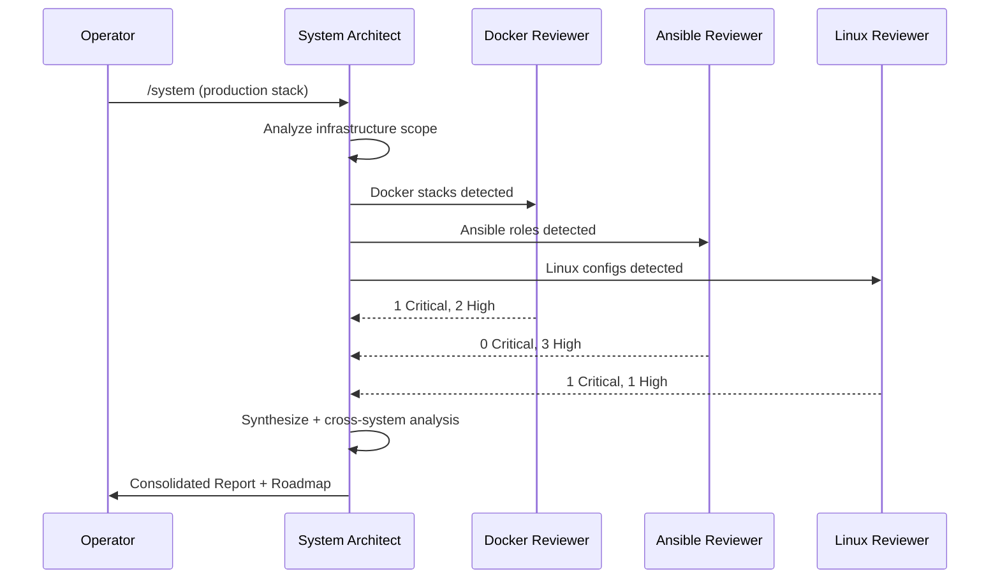
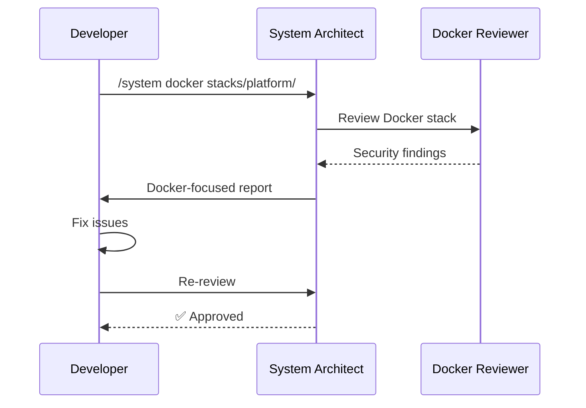

# System Agent Family Guide

> [Doctrine](../../README.md) > [AI](./README.md) > System Agents

The key words "MUST", "MUST NOT", "REQUIRED", "SHALL", "SHALL NOT", "SHOULD",
"SHOULD NOT", "RECOMMENDED", "MAY", and "OPTIONAL" in this document are to be
interpreted as described in [RFC 2119](https://datatracker.ietf.org/doc/html/rfc2119).

## Quick Reference

| Command | Agent | Model | Use Case |
|---------|-------|-------|----------|
| `/system` | System Architect | Opus | Full infrastructure assessment |
| `/system docker` | Docker Reviewer | Sonnet | Container/Compose review |
| `/system ansible` | Ansible Reviewer | Sonnet | Playbook/role review |
| `/system linux` | Linux Reviewer | Sonnet | OS configuration review |
| `/system verify` | Verify Build | Sonnet | CI/CD validation |
| `/system secrets` | Secrets Reviewer | Sonnet | Secrets management |
| `/system backup` | Backup Reviewer | Sonnet | Backup/DR strategy |
| `/system networking` | Networking Reviewer | Sonnet | Network security |
| `/system monitoring` | Monitoring Reviewer | Sonnet | Observability |
| `/system database` | Database Reviewer | Sonnet | PostgreSQL config |
| `/system traefik` | Traefik Reviewer | Sonnet | Reverse proxy config |
| `/system identity` | Identity Reviewer | Sonnet | Authentik/SSO config |
| `/system storage` | Storage Reviewer | Sonnet | Garage/ZFS config |
| `/system messaging` | Messaging Reviewer | Sonnet | EMQX/Kafka config |

Commands are listed under the family's own name. Claude Code 2.1.263 already claims
`/system`, so the installed entrypoint is `/doctrine-system`: see
[Installation](#installation) for the copy steps, the name probe, and the discovery check.
Nothing works until the definitions are copied into a discovery path.

## Overview

The Doctrine System Agent Family is a coordinated set of specialized AI agents
for comprehensive infrastructure and system analysis. Unlike ad-hoc reviews,
this family provides:

1. **Specialized Expertise** - Each agent is an expert in its domain
2. **Cost Optimization** - Right model for each task (Sonnet for specialists, Opus for coordination)
3. **Cross-System Analysis** - Identifies systemic issues across stack layers
4. **Security Focus** - Defense in depth, secrets management, least privilege
5. **Auto-Fix Oriented** - Every issue includes remediation steps

## Architecture

```text
┌─────────────────────────────────────────────────────────────────────────────┐
│                      DOCTRINE SYSTEM AGENT FAMILY                           │
├─────────────────────────────────────────────────────────────────────────────┤
│                                                                              │
│                      ┌────────────────────────────┐                         │
│                      │    SYSTEM ARCHITECT        │                         │
│                      │   (Opus - Coordinator)     │                         │
│                      └─────────────┬──────────────┘                         │
│                                    │                                         │
│  ┌────────────────────────────────────────────────────────────────────┐     │
│  │                     CORE INFRASTRUCTURE                             │     │
│  │  ┌────────┐ ┌────────┐ ┌────────┐ ┌────────┐                       │     │
│  │  │ DOCKER │ │ANSIBLE │ │ LINUX  │ │ VERIFY │                       │     │
│  │  │(Sonnet)│ │(Sonnet)│ │(Sonnet)│ │(Sonnet)│                       │     │
│  │  └────────┘ └────────┘ └────────┘ └────────┘                       │     │
│  └────────────────────────────────────────────────────────────────────┘     │
│                                                                              │
│  ┌────────────────────────────────────────────────────────────────────┐     │
│  │                   SECURITY & RESILIENCE                             │     │
│  │  ┌────────┐ ┌────────┐ ┌────────┐                                  │     │
│  │  │SECRETS │ │ BACKUP │ │NETWORK │                                  │     │
│  │  │(Sonnet)│ │(Sonnet)│ │(Sonnet)│                                  │     │
│  │  └────────┘ └────────┘ └────────┘                                  │     │
│  └────────────────────────────────────────────────────────────────────┘     │
│                                                                              │
│  ┌────────────────────────────────────────────────────────────────────┐     │
│  │                   INGRESS & IDENTITY                                │     │
│  │  ┌────────┐ ┌────────┐                                             │     │
│  │  │TRAEFIK │ │IDENTITY│                                             │     │
│  │  │(Sonnet)│ │(Sonnet)│                                             │     │
│  │  └────────┘ └────────┘                                             │     │
│  └────────────────────────────────────────────────────────────────────┘     │
│                                                                              │
│  ┌────────────────────────────────────────────────────────────────────┐     │
│  │                   DATA & OBSERVABILITY                              │     │
│  │  ┌────────┐ ┌────────┐ ┌────────┐ ┌────────┐                       │     │
│  │  │MONITOR │ │DATABASE│ │STORAGE │ │MESSAGE │                       │     │
│  │  │(Sonnet)│ │(Sonnet)│ │(Sonnet)│ │(Sonnet)│                       │     │
│  │  └────────┘ └────────┘ └────────┘ └────────┘                       │     │
│  └────────────────────────────────────────────────────────────────────┘     │
│                                                                              │
└─────────────────────────────────────────────────────────────────────────────┘
```

## Agent Specifications

### Tier 1: Strategic Coordinator

#### System Architect

The **System Architect** is the strategic coordinator for all infrastructure assessments.

| Attribute | Value |
|-----------|-------|
| **Model** | Opus 4.5 |
| **Command** | `/system` |
| **File** | `configs/claude/agents/system/architect.md` |

**Responsibilities**:

- Assess overall infrastructure security and configuration
- Route to appropriate specialist agents
- Synthesize findings across systems
- Identify cross-system concerns (secrets, networking, permissions)
- Provide prioritized remediation roadmap

**When to Use**:

- Comprehensive infrastructure review
- Production deployment readiness
- Security audit preparation
- Cross-system configuration validation

---

### Tier 2: Core Infrastructure Specialists

#### Docker Reviewer

Container and Docker Compose security specialist.

| Attribute | Value |
|-----------|-------|
| **Model** | Sonnet 4.5 |
| **Command** | `/system docker` |
| **File** | `configs/claude/agents/system/docker.md` |

**Coverage**:

- Dockerfile best practices and security
- Image pinning (digests vs tags)
- Container security (non-root, capabilities, read-only)
- Health checks and graceful shutdown
- Docker Compose organization
- Networking and secrets management
- Logging configuration

**Reference**: [Doctrine Docker Guide](../infrastructure/docker.md)

#### Ansible Reviewer

Ansible playbook and role review specialist.

| Attribute | Value |
|-----------|-------|
| **Model** | Sonnet 4.5 |
| **Command** | `/system ansible` |
| **File** | `configs/claude/agents/system/ansible.md` |

**Coverage**:

- FQCN (Fully Qualified Collection Names)
- Idempotency verification
- Secrets management (vault, no hardcoded secrets)
- Role structure and organization
- Task naming and documentation
- Handler usage
- Molecule testing setup
- Inventory best practices

**Reference**: [Doctrine Ansible Guide](../infrastructure/ansible.md)

---

#### Linux Reviewer

Linux system configuration and hardening specialist.

| Attribute | Value |
|-----------|-------|
| **Model** | Sonnet 4.5 |
| **Command** | `/system linux` |
| **File** | `configs/claude/agents/system/linux.md` |

**Coverage**:

- systemd unit security hardening
- SSH configuration (sshd_config)
- sysctl security settings
- Firewall rules (nftables)
- User and permission management
- AppArmor profiles
- Automatic updates (unattended-upgrades)
- Logging and auditing (journald)

**Reference**: [Doctrine Linux Guide](../infrastructure/os/linux.md), [SSH Guide](../infrastructure/services/ssh.md)

---

#### Verify Build

CI/CD and build validation specialist.

| Attribute | Value |
|-----------|-------|
| **Model** | Sonnet 4.5 |
| **Command** | `/system verify` |
| **File** | `configs/claude/agents/system/verify.md` |

**Coverage**:

- Build process validation
- Test execution and coverage
- Linting and formatting checks
- Type checking
- Dependency auditing
- CI/CD pipeline configuration
- Artifact generation

---

### Tier 3: Security & Resilience Specialists

#### Secrets Reviewer

Secrets management and encryption specialist.

| Attribute | Value |
|-----------|-------|
| **Model** | Sonnet 4.5 |
| **Command** | `/system secrets` |
| **File** | `configs/claude/agents/system/secrets.md` |

**Coverage**:

- SOPS/age encryption configuration
- Plaintext secret detection
- Docker secrets usage
- CI/CD secret injection
- Ansible vault usage
- Key rotation and lifecycle
- Secret access control

#### Backup Reviewer

Backup strategy and disaster recovery specialist.

| Attribute | Value |
|-----------|-------|
| **Model** | Sonnet 4.5 |
| **Command** | `/system backup` |
| **File** | `configs/claude/agents/system/backup.md` |

**Coverage**:

- 3-2-1 backup rule compliance
- RTO/RPO documentation
- Database backup (pgBackRest)
- Filesystem backup (restic, borg, ZFS)
- Backup automation and scheduling
- Recovery testing verification
- Retention policies
- Backup encryption

#### Networking Reviewer

Network security and configuration specialist.

| Attribute | Value |
|-----------|-------|
| **Model** | Sonnet 4.5 |
| **Command** | `/system networking` |
| **File** | `configs/claude/agents/system/networking.md` |

**Coverage**:

- Firewall configuration (nftables)
- DNS configuration (DoT, DNSSEC)
- Reverse proxy setup (Traefik)
- VPN configuration (Tailscale, WireGuard)
- TLS/SSL configuration
- Network segmentation
- Port exposure analysis
- IPv6 configuration

---

### Tier 4: Data & Observability Specialists

#### Monitoring Reviewer

Observability and alerting specialist.

| Attribute | Value |
|-----------|-------|
| **Model** | Sonnet 4.5 |
| **Command** | `/system monitoring` |
| **File** | `configs/claude/agents/system/monitoring.md` |

**Coverage**:

- Prometheus scrape configuration
- Metrics cardinality management
- Alert rules design
- Recording rules optimization
- Grafana dashboard design
- Log aggregation (Loki)
- SLO/SLI definitions
- Retention and storage policies

#### Database Reviewer

PostgreSQL configuration and operations specialist.

| Attribute | Value |
|-----------|-------|
| **Model** | Sonnet 4.5 |
| **Command** | `/system database` |
| **File** | `configs/claude/agents/system/database.md` |

**Coverage**:

- PostgreSQL configuration tuning
- Connection pooling (PgBouncer, PgCat)
- Replication configuration
- Backup configuration (pgBackRest)
- Security hardening
- Performance monitoring
- Maintenance (autovacuum)
- High availability setup

#### Storage Reviewer

Storage infrastructure specialist (S3-compatible and ZFS).

| Attribute | Value |
|-----------|-------|
| **Model** | Sonnet 4.5 |
| **Command** | `/system storage` |
| **File** | `configs/claude/agents/system/storage.md` |

**Coverage**:

- Garage (S3-compatible) configuration
- Bucket policies and access control
- Object lifecycle policies
- ZFS pool configuration
- ZFS dataset properties
- Snapshot and replication
- Scrub and maintenance
- Storage encryption

#### Messaging Reviewer

Messaging infrastructure specialist (MQTT and Kafka).

| Attribute | Value |
|-----------|-------|
| **Model** | Sonnet 4.5 |
| **Command** | `/system messaging` |
| **File** | `configs/claude/agents/system/messaging.md` |

**Coverage**:

- EMQX broker configuration
- MQTT ACL and authentication
- EMQX clustering
- Kafka broker configuration
- Kafka topic design
- Consumer configuration
- Schema management
- Message retention policies

---

### Tier 5: Ingress & Identity Specialists

#### Traefik Reviewer

Reverse proxy and ingress specialist.

| Attribute | Value |
|-----------|-------|
| **Model** | Sonnet 4.5 |
| **Command** | `/system traefik` |
| **File** | `configs/claude/agents/system/traefik.md` |

**Coverage**:

- TLS configuration
- Let's Encrypt / ACME
- Security headers middleware
- Rate limiting
- Entry points configuration
- Docker provider labels
- Access logging
- Service health checks

#### Identity Reviewer

Identity and access management specialist (Authentik).

| Attribute | Value |
|-----------|-------|
| **Model** | Sonnet 4.5 |
| **Command** | `/system identity` |
| **File** | `configs/claude/agents/system/identity.md` |

**Coverage**:

- OIDC/OAuth2 provider configuration
- SAML service provider configuration
- LDAP provider configuration
- MFA/authentication policies
- Flow design
- Outpost configuration
- Session and token management
- Group and permission management

---

## Severity Levels

All findings use RFC 2119 severity levels:

| Level | Keyword | Meaning | Action Required |
|-------|---------|---------|-----------------|
| **Critical** | **MUST FIX** | Security vulnerability, production risk | Block deployment |
| **High** | **MUST** | Significant security or operational issue | Fix before deployment |
| **Medium** | **SHOULD** | Best practice violation | Fix soon |
| **Low** | **MAY** | Minor enhancement | Consider |
| **Info** | N/A | Observation only | Awareness |

## Output Format

All system agents **MUST** use this output format:

````markdown
## System Review: [Brief Title]

| Metric | Value |
|--------|-------|
| **Review Effort** | [1-5] |
| **Risk Level** | Low / Medium / High / Critical |
| **Environment** | Development / Staging / Production |

### 🔴 Critical (must fix before deployment)

- [ ] **[Category]**: [description] (`file:line`)

  **Current**:
  ```[lang]
  [problematic config]
  ```

  **Recommended**:

  ```[lang]
  [fixed config]
  ```

  **Why**: [explanation with Doctrine reference]

### 🟡 Warning (should fix)

### 🔵 Suggestion (consider)

### ✅ Positive Observations

### Summary

[1-2 sentence overall assessment]

````

## Cross-System Analysis

The System Architect identifies issues that span multiple systems:

### Secrets Management

| System | Good Practice | Check |
|--------|---------------|-------|
| Ansible | Vault encryption | No plaintext secrets |
| Docker | Docker secrets | Not in environment |
| Linux | 600 permissions | Not world-readable |

### Network Security

| System | Good Practice | Check |
|--------|---------------|-------|
| Linux | nftables default deny | Explicit allow rules |
| Docker | Bridge networks | Not host network |
| Ansible | Firewall playbook | Consistent rules |

### User/Permission Model

| System | Good Practice | Check |
|--------|---------------|-------|
| Linux | Service accounts | nologin shell |
| Docker | Non-root user | user: directive |
| Ansible | Targeted become | Not become: yes everywhere |

## Cost Optimization

| Agent | Model | Est. Cost/Invocation | Volume |
|-------|-------|---------------------|--------|
| System Architect | Opus | $0.60 | Per major deployment |
| Docker Reviewer | Sonnet | $0.25 | Per Docker change |
| Ansible Reviewer | Sonnet | $0.25 | Per playbook change |
| Linux Reviewer | Sonnet | $0.25 | Per config change |
| Verify Build | Sonnet | $0.20 | Per CI run |
| Secrets Reviewer | Sonnet | $0.25 | Per secrets change |
| Backup Reviewer | Sonnet | $0.25 | Per backup config change |
| Networking Reviewer | Sonnet | $0.25 | Per network change |
| Monitoring Reviewer | Sonnet | $0.25 | Per monitoring change |
| Database Reviewer | Sonnet | $0.25 | Per database config change |
| Traefik Reviewer | Sonnet | $0.25 | Per ingress change |
| Identity Reviewer | Sonnet | $0.25 | Per identity config change |
| Storage Reviewer | Sonnet | $0.25 | Per storage change |
| Messaging Reviewer | Sonnet | $0.25 | Per messaging change |

**Cost by Mode**:

| Mode | Typical Cost | Use Case |
|------|--------------|----------|
| `/system docker` | ~$0.25 | Specific Docker review |
| `/system ansible` | ~$0.25 | Specific Ansible review |
| `/system secrets` | ~$0.25 | Secrets management review |
| `/system backup` | ~$0.25 | Backup strategy review |
| `/system networking` | ~$0.25 | Network security review |
| `/system monitoring` | ~$0.25 | Observability review |
| `/system database` | ~$0.25 | Database config review |
| `/system traefik` | ~$0.25 | Reverse proxy review |
| `/system identity` | ~$0.25 | Identity/SSO review |
| `/system storage` | ~$0.25 | Storage config review |
| `/system messaging` | ~$0.25 | Messaging config review |
| `/system` | ~$2.00 | Full infrastructure assessment |

## Workflow Examples

### Example 1: Production Deployment Review



### Example 2: Docker Stack Review



## Installation

Claude Code discovers subagents and commands by file location alone. Definitions that stay
under `configs/` are never loaded, and no settings key switches them on. Installations
**MUST** copy the definitions into a documented discovery path.

**Why**: verified against Claude Code 2.1.263. From an empty project with the definitions
left under `configs/`:

```console
$ claude --settings '{"agents":{"system":{"enabled":true}}}' \
    --agent system-architect -p 'Return OK.'
--agent 'system-architect' not found. Available agents: claude, Explore,
general-purpose, Plan, statusline-setup
```

Copying the same 14 files into `.claude/agents/system/` made all 14 discoverable with no
other change. The [settings reference](https://code.claude.com/docs/en/settings-reference)
has no `agents` registry: its only related key is `agent`, a string naming the subagent the
main thread runs as. Earlier revisions of this guide showed `agents.system.enabled`,
`agents.system.productionStrict` and `agents.system.defaultMode`; none of the three is a
documented key. The failure above is identical when all three are passed and identical when
the settings object is omitted, so the keys install nothing.

### Choose an installation scope

| Scope | Subagent path | Command path | Applies to |
|-------|---------------|--------------|------------|
| Project | `.claude/agents/` | `.claude/skills/` | one repository, checked into version control |
| User | `~/.claude/agents/` | `~/.claude/skills/` | every project on one machine |
| Plugin | `<plugin>/agents/` | `<plugin>/skills/` | every project where the plugin is enabled |

Teams **MUST** use project scope so the review contract is versioned with the infrastructure
it reviews. Individuals working across unrelated repositories **SHOULD** use user scope.
Plugin scope **SHOULD** be used when the family is distributed to other organisations,
because plugin subagents load under a `<plugin>:<name>` namespace and cannot collide with a
project's own definitions.

**Why**: project subagents are read by walking up from the working directory, and a project
definition overrides a user definition of the same name, so a repository can pin a reviewer
without touching a contributor's machine. Scope precedence is documented in the
[subagents reference](https://code.claude.com/docs/en/sub-agents).

### Install the 14 subagents

```bash
mkdir -p .claude/agents/system
cp configs/claude/agents/system/*.md .claude/agents/system/
```

Claude Code scans `.claude/agents/` recursively, so the `system/` subfolder is loaded and
keeps the family together. Identity comes only from the `name` frontmatter field, never from
the path, so the names below are what `--agent` and explicit delegation accept:

| Source file | Agent `name` | Model | Command |
|-------------|--------------|-------|---------|
| `architect.md` | `system-architect` | opus | `/doctrine-system` |
| `docker.md` | `docker-reviewer` | sonnet | `/doctrine-system docker` |
| `ansible.md` | `ansible-reviewer` | sonnet | `/doctrine-system ansible` |
| `linux.md` | `linux-reviewer` | sonnet | `/doctrine-system linux` |
| `verify.md` | `build-verification` | sonnet | `/doctrine-system verify` |
| `secrets.md` | `secrets-reviewer` | sonnet | `/doctrine-system secrets` |
| `backup.md` | `backup-reviewer` | sonnet | `/doctrine-system backup` |
| `networking.md` | `networking-reviewer` | sonnet | `/doctrine-system networking` |
| `monitoring.md` | `monitoring-reviewer` | sonnet | `/doctrine-system monitoring` |
| `database.md` | `database-reviewer` | sonnet | `/doctrine-system database` |
| `traefik.md` | `traefik-reviewer` | sonnet | `/doctrine-system traefik` |
| `identity.md` | `identity-reviewer` | sonnet | `/doctrine-system identity` |
| `storage.md` | `storage-reviewer` | sonnet | `/doctrine-system storage` |
| `messaging.md` | `messaging-reviewer` | sonnet | `/doctrine-system messaging` |

Names **MUST** stay unique across the whole `.claude/agents/` tree. Two files declaring the
same `name` in one directory leave only one loaded, chosen by filesystem read order.

A session that started before `.claude/agents/` existed does not see the new directory.
Restart Claude Code after the first install; later edits are picked up within seconds.

### Install the entrypoint command

Install the entrypoint as a skill, which is the current form of a custom command:

```bash
mkdir -p .claude/skills/doctrine-system
cp configs/claude/commands/system.md .claude/skills/doctrine-system/SKILL.md
```

Add YAML frontmatter with a `description` to the top of the copied `SKILL.md` so Claude can
load it on its own rather than only on an explicit invocation:

```yaml
---
description: Route an infrastructure review to the Doctrine system agent family.
---
```

Installations that still use the legacy layout **MAY** copy the file to
`.claude/commands/doctrine-system.md` instead; a skill and a command of the same name resolve
to the skill. New installations **SHOULD** use the skill form, because only skills carry a
directory for supporting files and frontmatter that controls who may invoke them.

### Do not name the entrypoint `system`

Claude Code 2.1.263 claims `/system` for itself, so a project skill of that name cannot be
relied on to run:

```console
$ HOME="$(mktemp -d)" claude --safe-mode -p '/doctrine-system probe'
Unknown command: /doctrine-system

$ HOME="$(mktemp -d)" claude --safe-mode -p '/system probe'
Not logged in · Please run /login
```

`--safe-mode` disables every custom and bundled skill, and `/system` still resolves past
command lookup while `/systemx`, `/syste` and `/systems` do not. The
[skills reference](https://code.claude.com/docs/en/skills) documents precedence for a custom
skill against a bundled skill and against `.claude/commands/`, but not against a built-in
command, so the outcome of the collision is undefined.

Installations therefore **MUST** install the entrypoint under a name Claude Code does not
claim, and **MUST** check the chosen name first with the probe above: `Unknown command`
means the name is free, any other output means it is taken. This guide uses
`doctrine-system`. Read every `/system <mode>` in this guide as `/doctrine-system <mode>`.

**Why**: the throwaway `HOME` keeps the probe out of your own configuration, so a claimed
name stops at the login check instead of running whatever Claude Code has bound to it.

### Smoke-check discovery

Confirm the subagents are discoverable before relying on them. Asking for a name that does
not exist makes Claude Code print every registered agent and exit non-zero without
contacting a model:

```bash
claude --agent doctrine-discovery-probe -p 'noop' 2>&1 |
  grep -q system-architect && echo 'system agents discovered'
```

CI **SHOULD** run this check. A missing install raises no error of its own: the run in the
**Why** above named the family in `--settings` and Claude Code reported nothing about the
absent definitions until an explicit `--agent` lookup forced the question.

### Pin the session agent (optional)

To run a whole session as one reviewer rather than delegating to it, set the documented
`agent` key in `.claude/settings.json`:

```json
{
  "agent": "system-architect"
}
```

`--agent` overrides this key for a single session.

## Best Practices

### DO

- **MUST** copy the definitions into a discovery path and pass the discovery smoke check
  before relying on any finding
- **MUST** run `/system` before production deployments
- **MUST** run `/system docker` when modifying Docker stacks
- **MUST** run `/system ansible` when modifying playbooks/roles
- **MUST** address Critical and High findings before deployment
- **SHOULD** use `/system linux` after OS configuration changes
- **MAY** run `/system verify` in CI/CD pipeline

### DON'T

- **MUST NOT** ignore Critical findings
- **MUST NOT** enable the family through `.claude/settings.json` keys; the settings reference
  has no `agents` registry and such keys install nothing
- **MUST NOT** deploy to production without system review
- **SHOULD NOT** skip review for "small" infrastructure changes
- **SHOULD NOT** rely solely on automated checks without human review

## Future Agents

Planned additions to the System Agent Family:

| Agent | Purpose | Status |
|-------|---------|--------|
| Kubernetes Reviewer | K8s manifests and Helm charts | Planned |
| Terraform Reviewer | Infrastructure as code | Planned |

## See Also

- [Code Agent Family](./code-agents.md) — Code quality review agents
- [Security Agent Family](./security-agents.md) — Security-focused agents
- [Claude Code CLI](./claude-code.md) — CLI configuration

---

*Last Updated: 2026-01-02*
*Version: 3.0.0*
